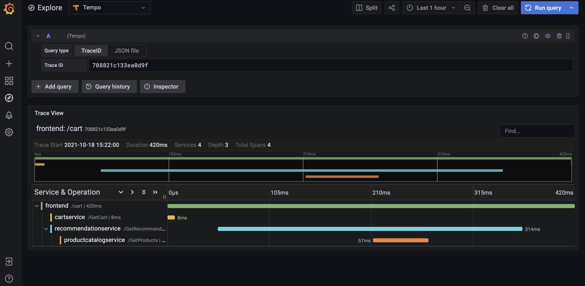

# grafana-tempo
POC for grafana tempo

## Minikube Setup
[Already done here](https://github.com/shreyasgune/grafana-tempo.git)

## Initial Setup
```
helm repo add grafana https://grafana.github.io/helm-charts

helm upgrade --install tempo grafana/tempo
```

## Microservices Track
``` 
helm upgrade -f microservices-grafana-values.yaml --install grafana grafana/grafana

kubectl create -f microservices-extras.yaml 
```

## Single Binary Track
```
helm upgrade -f single-binary-grafana-values.yaml --install grafana grafana/grafana

kubectl create -f single-binary-extras.yaml --validate=false

```


--------
## Get Trace ID

`kubectl logs synthetic-load-generator-####-###`

```
21/10/18 19:22:00 INFO ScheduledTraceGenerator: Emitted traceId 1de791e904eefd92 for service frontend route /cart
21/10/18 19:22:00 INFO ScheduledTraceGenerator: Emitted traceId 7956a9f35079fdfd for service frontend route /cart
21/10/18 19:22:00 INFO ScheduledTraceGenerator: Emitted traceId 708821c133ea0d9f for service frontend route /cart
```

## Explore in Grafana

`kubectl port-forward deployments/grafana 3000`

Browser: `http://localhost:3000/explore`




